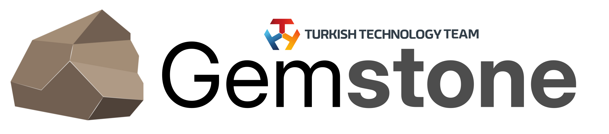

<p align="center">
    <picture>
        <source media="(prefers-color-scheme: dark)" srcset=".meta/logo-dark.png" width="40%" />
        <source media="(prefers-color-scheme: light)" srcset=".meta/logo-light.png" width="40%" />
        
    </picture>
</p>

# T3 Gemstone Boards Examples

 [](https://www.t3vakfi.org/en) [](https://opensource.org/licenses/Apache-2.0) [](https://www.jetify.com/devbox/docs/contributor-quickstart/) [](https://github.com/astral-sh/uv)

## What is it?

This repository contains example projects that demonstrate the features of T3 Gemstone boards.

All details related to the project can be found at https://docs.t3gemstone.org/en/tutorials. Below, only a summary of how to perform the installation is provided.

1. Install jetify-devbox on the host computer.

```bash
user@host:$ ./setup.sh
```

2. After the installation is successful, activate the jetify-devbox shell to automatically install tools such as AstralUV, Qt6 Libraries etc.

```bash
user@host:$ devbox shell
```

3. Start Notebook

```bash
📦 devbox:examples> devbox run marimo
```

### Screencast

[](https://asciinema.org/a/C5qNKCAyAuwIgoIxx0Wk1E7L2)
